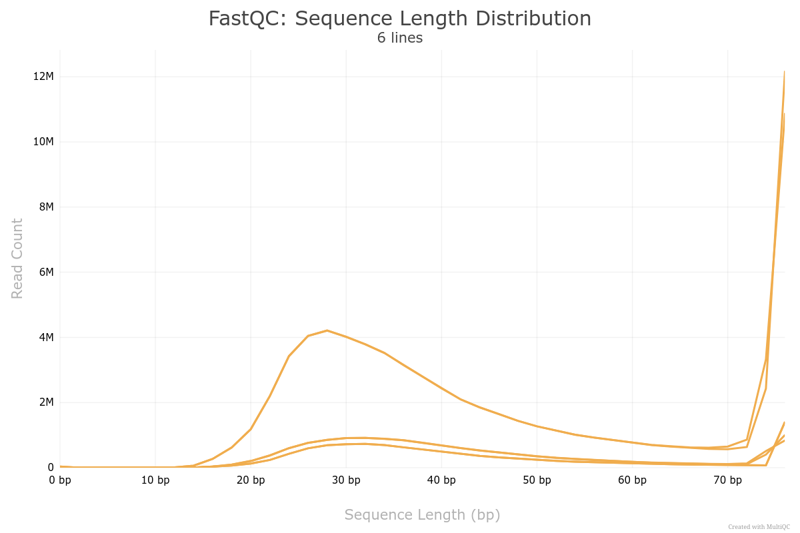
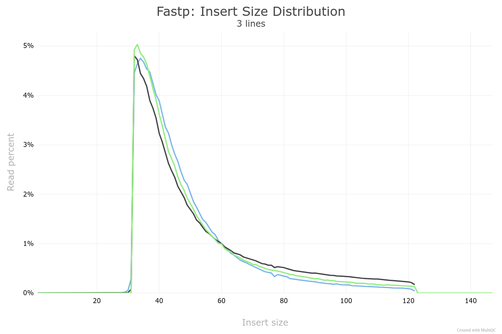

# nf-core/mag protocol supplement

[](https://doi.org/10.5281/zenodo.18769828)

This is a complementary step-by-step guide to Fellows Yates et al. (2026, in preparation) with explicit commands for running nf-core/mag for ancient metagenomes.

## Requirements

This tutorial assumes you have:

- A UNIX based machine (Linux, OSX)
- At least 768.GB memory
- At least 64 CPUs
- At least 300 GB of free hard-drive space
- An internet connection

> [!NOTE]
> If you do not have sufficient resources, you can still follow the tutorial.
> Skipping to [Evaluating the results](#evaluating-the-results), where the necessary results files are available pre-made for you.

## Installation and Setup

1. Set up directory structure for tutorial by cloning this repository and creating the required subdirectories

   ```bash
    git clone https://github.com/paleobiotechnology/nfcore-mag-adna-protocol.git

   ## Change into the cloned repo, and set this as root for the remainder of the tutorial
   cd nfcore-mag-adna-protocol
   export TUTORIAL_DIR=$(pwd)
   ```

   > ℹ️ We assume you will want to remove the entire contents of this tutorial on completion.
   > If you wish to retain certain files (e.g. downloaded databases), make sure to place them in a safe location outside the tutorial directory, and update file paths accordingly.

2. (⚠️ if not already installed) Install conda through miniforge

   ```bash
   ## Download the installation script
   curl -L -o ${TUTORIAL_DIR}/bin/Miniforge3-$(uname)-$(uname -m).sh "https://github.com/conda-forge/miniforge/releases/latest/download/Miniforge3-$(uname)-$(uname -m).sh"

   ## Run installer
   bash ${TUTORIAL_DIR}/bin/Miniforge3-$(uname)-$(uname -m).sh -b -s -p ${TUTORIAL_DIR}/bin/Miniforge3

   ## Configure miniconda - replace 'YOUR_SHELL_NAME' in the `eval` command in lower case - e.g. shell.bash
   eval "$($TUTORIAL_DIR/bin/Miniforge3/bin/conda shell.YOUR_SHELL_NAME hook)"
   conda init
   conda config --set auto_activate_base false
   ```

   > ℹ️ Miniforge is the preferred distribution of conda, as it does not come with any restrictive usage licenses as it does not include the Anaconda Inc.'s paid default channel.

3. Exit your terminal, and make a new window. Change back into the tutorial directory.

   ```bash
   cd $TUTORIAL_DIR
   ```

   > You might have to redefine the `TUTORIAL_DIR` environment variable

4. Create environment (`-y` is specified to automatically accept proposed dependencies, remove if you wish to check)

   ```bash
   conda create -y -n nextflow -c bioconda nextflow=25.04.2
   ```

5. Load environment, and set the NXF_HOME to allow efficient cleanup at end of tutorial

   ```bash
   conda activate nextflow

   ## Set home
   mkdir -p bin/nextflow/assets
   export NXF_HOME=${TUTORIAL_DIR}/bin/nextflow/
   export NXF_ASSETS=${TUTORIAL_DIR}/bin/nextflow/assets
   ```

6. Download nf-core/mag

   ```bash
   nextflow pull nf-core/mag -r 5.4.0
   ```

7. Deactivate conda environment

   ```bash
   conda deactivate
   ```

## Database Downloading

1. Make conda environment for tools that require a specific tool to download the database
   - GUNC (`-y` is specified in the conda command to automatically accept proposed dependencies, remove if you wish to check)

     ```bash
     conda create -y -n gunc -c bioconda gunc=1.0.6
     conda activate gunc
     mkdir $TUTORIAL_DIR/cache/database/gunc_db
     gunc download_db $TUTORIAL_DIR/cache/database/gunc_db
     conda deactivate
     cd $TUTORIAL_DIR/
     ```

- GTDB:

  ```bash
  screen -R gdtb_download ## to allow disconnection from server while running, use ctrl + a + d to detach, and `screen -r gtdb_download` to re-attach
  wget -O $TUTORIAL_DIR/cache/database/gtdbtk_r226_data.tar.gz https://data.gtdb.aau.ecogenomic.org/releases/release226/226.0/auxillary_files/gtdbtk_package/full_package/gtdbtk_r226_data.tar.gz
  tar -xzf $TUTORIAL_DIR/cache/database/gtdbtk_r226_data.tar.gz gtdbtk_r226_data.tar.gz -C $TUTORIAL_DIR/cache/database/gtdbtk_r226
  cd $TUTORIAL_DIR/
  ```

  > ⚠️ This is very large >110GB file, and it takes a long time to download.
  > We recommend re-using an already downloaded database if possible.
  > In this case symlink the `gtdbtk_r226/` directory to the cache directory:
  >
  > ```bash
  > ln -s /<your>/<path>/<to>/gtdbtk_r226/ $TUTORIAL_DIR/cache/database/gtdbtk_r226
  > ```

- CheckM:

  ```bash
  wget -O $TUTORIAL_DIR/cache/database/checkm_data_2015_01_16.tar.gz https://data.ace.uq.edu.au/public/CheckM_databases/checkm_data_2015_01_16.tar.gz
  mkdir $TUTORIAL_DIR/cache/database/checkm_data_2015_01_16/
  tar -xzf $TUTORIAL_DIR/cache/database/checkm_data_2015_01_16.tar.gz -C $TUTORIAL_DIR/cache/database/checkm_data_2015_01_16
  cd $TUTORIAL_DIR/
  ```

## Example data retrieval

For the purposes of this tutorial, we will use an ancient Iberian human dental calculus sample 'ECO014.B', originally published in [Fellows Yates et al. (2021, PNAS)](https://doi.org/10.1073/pnas.2021655118), that comes from a Mesolithic site in Valencia.
This sample was analysed in a study to reconstruct the taxonomic profiles of ancient oral microbiomes of ancient hominins.

From this sample three libraries have been generated and sequenced across three sequencing runs.
All three were built into a double stranded library with the PfuTurbo Cx Hotstart DNA polymerase that is tolerant of ancient DNA damage and sequenced on the Illumina NextSeq 500 platform.

| sample_name | library_name       | archive | archive_project | archive_sample_accession | archive_data_accession | strand_type | library_polymerase       | library_treatment | instrument_model | library_layout | read_count |
| ----------- | ------------------ | ------- | --------------- | ------------------------ | ---------------------- | ----------- | ------------------------ | ----------------- | ---------------- | -------------- | ---------- |
| ECO004.B    | ECO004.B0101       | ENA     | PRJEB34569      | ERS3774460               | ERR3579731             | double      | PfuTurbo Cx Hotstart DNA | none              | NextSeq 500      | PAIRED         | 13,625,140 |
| ECO004.B    | ECO004.B0103.SG1.1 | ENA     | PRJEB34569      | ERS3774460               | ERR3579732             | double      | PfuTurbo Cx Hotstart DNA | full-udg          | NextSeq 500      | PAIRED         | 67,123,133 |
| ECO004.B    | ECO004.B0102       | ENA     | PRJEB55583      | ERS3774460               | ERR10114849            | double      | PfuTurbo Cx Hotstart DNA | half-udg          | NextSeq 500      | PAIRED         | 21,007,806 |

The primary difference between the three libraries is each have a different 'UDG' treatment applied, that removes increasingly more damage from the DNA molecules, and the sequencing depth.
The two shallow-sequenced libraries had no or only partial damage removal, whereas the deeper sequenced library had full-UDG treatment and thus has had all damage removed.

We can retrieve the raw sequencing data and prepared input sheets from via the tool `amdirt` ([Borry et al. 2024, F1000Research](https://doi.org/10.12688/f1000research.134798.2)) from the European Nucleotide Archive (ENA).

We can install `amdirt` in a separate conda environment:

```bash
   conda create -y -n amdirt -c bioconda amdirt=1.7.1
   conda activate amdirt
```

> [!NOTE]
> You could also use the `amdirt` graphical user interface filter for the correct rows in the table, however we assume you're running on a remote server due to the resource requirements for the pipeline.

First we download the AncientMetagenomeDir host-associated libraries table:

```bash
mkdir -p data/amdirt/
amdirt download  --output $TUTORIAL_DIR/data/amdirt/ -t ancientmetagenome-hostassociated -y samples -r v25.12.0
amdirt download  --output $TUTORIAL_DIR/data/amdirt/ -t ancientmetagenome-hostassociated -y libraries -r v25.12.0
```

We can then use basic `bash` tools to filter to the required sequencing runs.

```bash
for i in samples libraries; do
   grep -e 'project_name' -e 'ECO004.B' $TUTORIAL_DIR/data/amdirt/ancientmetagenome-hostassociated_${i}_v25.12.0.tsv > $TUTORIAL_DIR/data/amdirt/ancientmetagenome-hostassociated_${i}_v25.12.0_filtered.tsv
done
```

We can then convert these samplesheets using `amdirt` to different files for preparing the input for nf-core/mag.

```bash
## Raw data
amdirt convert --libraries $TUTORIAL_DIR/data/amdirt/ancientmetagenome-hostassociated_libraries_v25.12.0_filtered.tsv -o data/raw_data --curl $TUTORIAL_DIR/data/amdirt/ancientmetagenome-hostassociated_samples_v25.12.0_filtered.tsv ancientmetagenome-hostassociated

## Samplesheet
amdirt convert --libraries $TUTORIAL_DIR/data/amdirt/ancientmetagenome-hostassociated_libraries_v25.12.0_filtered.tsv -o analysis/mag/ --mag --bibliography $TUTORIAL_DIR/data/amdirt/ancientmetagenome-hostassociated_samples_v25.12.0_filtered.tsv ancientmetagenome-hostassociated
conda deactivate
```

We can then run the `curl` shell script to download the raw data from ENA, and update the samplesheet with the correct paths to the raw data.

```bash
screen -R eco-curl-dl
cd $TUTORIAL_DIR/data/raw_data/
bash AncientMetagenomeDir_curl_download_script.sh
cd $TUTORIAL_DIR/
```

Once downloaded, we can add the full paths in the samplesheet.

```bash
## To verify the correct paths
sed "s#,ERR#,$TUTORIAL_DIR/data/raw_data/ERR#g" analysis/mag/AncientMetagenomeDir_nf_core_mag_input_paired_table.csv

## To update the samplesheet (run only when you're happy the paths are correct!)
sed -i "s#,ERR#,$TUTORIAL_DIR/data/raw_data/ERR#g" analysis/mag/AncientMetagenomeDir_nf_core_mag_input_paired_table.csv
```

## Pipeline setup and run

There are multiple different ways to specify nf-core/mag parameters, we'll highlight the two main ones.

For preparing our command we will skip a few steps that are not necessary for the purposes of this tutorial for reasons of speed, such as skipping metaeuk (can be slow, for eukaryotic contig detection), SPAdes (which is very slow and requires large amounts of computational resources), and Prodigal annotation (which will instead be performed at the bin level with Prokka).
We also exclude unbinned contigs from post-binning to reduce run time, and use the older CheckM version as it is the most routinely and established tool (however CheckM2 will mostly likely perform better on a wider range of bacteria and archaea).

We will then tweak some relevant parameters that should be adjusted due to the nature of ancient DNA samples, such as setting a short minimum read length, host genome to GRCh37 for host DNA removal, as well as removing contigs less than 500 bp (which we expect many of because of the fragmented nature of aDNA).

Finally we also run `--ancient_dna` for automatic setting of suitable short-read-to-contig mapping parameters, damage authentication with pyDamage, and damage correction with freeBayes.

> [!WARNING]
> This command or `params.yml` method of configuration assumes you are running on a server with internet access, and specifically to the public AWS iGenome bucket for downloading pre-made host genome indices.
>
> If you do not have internet access, you will need to download the host genome indices yourself, and specify the path to the local genome FASTA file with the `--host_fasta` parameter.
> Furthermore, if you have pre-built indices of the genome, you can additionally specify the `--host_fasta_bowtie2index` parameter to point to the directory containing bowtie2 index files of the genome.

### The CLI way

We can run the pipeline via a full command line execution.

First make sure to create a `screen` session to allow disconnection from the server while running the pipeline, and everything you need to run the pipeline is loaded.

```bash
screen -R mag_run
export TUTORIAL_DIR=$(pwd)
conda activate nextflow
cd analysis/mag
## Don't forget any other dependencies you need to run the pipeline on your specific infrastructure, such as `module load` commands!
```

Then you can run the pipeline with the following command.

Note that a backslash character can be used to break up a long single command into multiple lines.

> [!TIP]
> Alternatively, replace `-profile conda` with an institutional existing profile e.g. from nf-core/configs or a custom one with -c
> For example, in the below, we use a custom config file `custom.config` that is located in the same directory as the samplesheet to increase memory requirements for both the `CHECKM_LINEAGEWF` and `GTDBTK_LINEAGEWF` steps of the pipeline.

```bash
nextflow run nf-core/mag \
-r 5.4.0 \
-profile conda \
--input $TUTORIAL_DIR/analysis/mag/AncientMetagenomeDir_nf_core_mag_input_paired_table.csv \
--outdir $TUTORIAL_DIR/analysis/mag/results \
--reads_minlength 30 \
--igenomes_base 's3://ngi-igenomes/igenomes/' \
--host_genome GRCh37 \
--skip_spades \
--skip_spadeshybrid \
--skip_prodigal \
--skip_metaeuk \
--binning_map_mode own \
--min_contig_size 500 \
--save_assembly_mapped_reads \
--exclude_unbins_from_postbinning \
--run_checkm \
--run_busco false \
--checkm_db $TUTORIAL_DIR/cache/database/checkm_data_2015_01_16 \
--refine_bins_dastool \
--refine_bins_dastool_threshold 0.3 \
--postbinning_input refined_bins_only \
--run_gunc \
--gunc_db $TUTORIAL_DIR/cache/database/gunc_db/gunc_db_progenomes2.1.dmnd \
--gtdb_db $TUTORIAL_DIR/cache/database/release226 \
--ancient_dna \
-c $TUTORIAL_DIR/analysis/mag/custom.conf
```

> [!TIP]
> If you get an error message of `ERROR ~ /analysis`, check that the `$TUTORIAL_DIR environment variable is set correctly.

Note that we have set a lower DAS Tool bin refinement threshold score than the default in nf-core/mag.
Following recommendation 7 and 11 of Box 1 of Fellows Yates et al. 2026, we reduce the score to account for the expected 'lower quality' of bins due to the higher fragmentation of the assemblies due to the very short reads.
Furthermore, we have set a minimum contig length to 500 (Recommendation 8 of Box 1 of Fellows Yates et al. 2026), to remove ultra-short contigs which due to the fragmentation are expected to be present at high numbers and will greatly slow down the pipeline without much downstream analytical value.
The specific thresholds will however depend on the aims of the project, and the quality of data and is not necessarily generalisable to all contexts.

### The JSON way

However, setting up each parameter directly from the CLI can quickly become cumbersome.

Alternatively, another way to specify parameters is to use a parameters JSON file, here saved as `nf-params.json`.
This JSON file can either be prepared manually in a text editor, or with the help of the online interactivate nf-core/launch tool ([https://nf-co.re/launch/](https://nf-co.re/launch/)).
Once parameters have been specified, nf-core tools provides a `nf-params.json` to download.


This is the content of the resulting `nf-params.json` file:

```json
{
  "reads_minlength": 30,
  "host_genome": "GRCh37",
  "skip_spades": true,
  "skip_spadeshybrid": true,
  "skip_prodigal": true,
  "skip_metaeuk": true,
  "binning_map_mode": "own",
  "min_contig_size": 500,
  "save_assembly_mapped_reads": true,
  "exclude_unbins_from_postbinning": true,
  "run_checkm": true,
  "run_busco": false,
  "refine_bins_dastool": true,
  "refine_bins_dastool_threshold": 0.3,
  "postbinning_input": "refined_bins_only",
  "run_gunc": true,
  "ancient_dna": true
}
```

This `nf-params.json` is then used to specify the parameters on the command line like so:

```bash
nextflow run nf-core/mag \
-r 5.4.0 \
-profile conda \
--input $TUTORIAL_DIR/analysis/mag/AncientMetagenomeDir_nf_core_mag_input_paired_table.csv \
--outdir $TUTORIAL_DIR/analysis/mag/results_params \
--igenomes_base 's3://ngi-igenomes/igenomes/' \
--checkm_db $TUTORIAL_DIR/cache/database/checkm_data_2015_01_16 \
--gunc_db $TUTORIAL_DIR/cache/database/gunc_db/gunc_db_progenomes2.1.dmnd \
--gtdb_db $TUTORIAL_DIR/cache/database/release226 \
-c $TUTORIAL_DIR/analysis/mag/custom.conf \
-params-file $TUTORIAL_DIR/analysis/mag/nf-params.json
```

> [!TIP]
> Using a `params.json` also helps promote reproducible science, allowing yourself but also other researchers to reproduce your results without risk of typo-derived errors!
>
> We recommend using the JSON method for supplying parameters, and include this file as supplementary data in your publications (make sure not to include file paths, however - these should stay on the command line!).

For us on a shared(!) SLURM HPC cluster, the run (including the creation of fresh conda environments) took:

```log
Duration    : 14h 2m 23s
CPU hours   : 318.4
```

## Evaluating the results

Once our pipeline run has completed, before we dive into analysing each MAG separately, we want to get an overview on the quality of the data, assembly, and final bins.

For this, there are two primary files you should inspect:

- `< --outdir >/multiqc/multiqc_report.tsv`
- `< --outdir >/GenomeBinning/bin_summary.tsv`

These provide aggregated summary reports.

Otherwise, we can manually explore the raw output from the respective per-tool directories.

### Raw data, preprocessing and assembly evaluation

To firstly evaluate the raw data (assuming not already performed prior running nf-core/mag), preprocessing, and initial assembly, we want to inspect the `multiqc_report.tsv` file.

> [!NOTE]
> If you have not executed the pipeline or still waiting for it to finish, you can find already made MultiQC in [`$TUTORIAL_DIR/analysis/premade_mag_results/`](data/premade_mag_results/execution-cli/multiqc_report.html).
> Press the 'Download' button in the top right of the file view, or right click the 'Raw' button and press 'Save Link As...'.
>
> It does not matter which execution run you look at, however be aware that _binning_ is not 100% deterministic, so you may find a some differences the names, and in the number of lower quality bins, between the two execution methods.

In the MultiQC report, the primary sections you will want to evaluate are:

- FastQC (before and after)
- fastp
- Bowtie2: PhiX removal
- Bowtie2: host removal\
- QUAST: assembly

The remaining sections will be covered in [Binning evaluation](#binning-evaluation).

Following the summary of recommendations in Box 1 of Fellows Yates et al. 2026, we can use this report to evaluate the quality of data production, sequencing depth, and other preprocessing steps such as host removal.

#### FastQC (raw and after preprocessing)

As a general rule, evaluating the FastQC results follows typical NGS sequencing quality metrics.

In the context of running nf-core/mag with ancient DNA we should in particular check that in the first FastQC section 'Sequence Counts', we have the number of reads requested from the sequencing facility.
As a general rule, in metagenomic _de novo_ assembly the more, the better - therefore you should double check that you received what you expected (Recommendation 2 of Box 1 of Fellows Yates et al. 2026).

You can also check the 'Sequence Length Distribution' section for a distribution with a peak somewhere in the range of 20-70 bp, which is the typical length of ancient DNA reads.
If you have no peak around here, this _may_ (but not always!) indicate a badly preserved sample.
If you do have this peak, this implies that you likely used suitable protocols for DNA extraction and library build that retain these very short sequences (Recommendation 1 and 3 of Box 1 of Fellows Yates et al. 2026).



You should also compare the 'FastQC: preprocessing' results section with the first 'raw reads' section to make sure all metrics have improved as expected (e.g. adapter content has reduced - however in this tutorial as we are using public data, this has already been removed).

#### fastp

As a general rule, evaluating the fastp results follows typical NGS sequencing quality metrics.

You should see a general improvement in the reduction of N content and sequencing quality.

As with FastQC, the 'Insert Size Distribution' section can give you an indication of the presence of 'true' fragmented aDNA reads, with an expected peak - in this case of the ECO004 libraries around 30-40 bp.



If you see no evidence of ultra-short reads, it may imply your read filtering settings are incorrect (Recommendation 7 of Box 1 of Fellows Yates et al. 2026).

#### Bowtie2 (PhiX and host removal)

In the Bowtie2 sections, you expect to see a certain amount of PhiX (assuming it's used as a control by your sequencing facility) and host DNA (in the case of this tutorial, _Homo sapiens_) being removed.

The host DNA removed metrics should be particularly paid close attention to, to ensure that it doesn't result in broken and/or chimeric contigs containing host DNA that can match contaminated reference genomes during taxonomic classification of contigs (Recommendation 4 of Box 1 of Fellows Yates et al. 2026).

The exact amount will depend on the sample type, and sequencing depth.
If you expected to see more, you should review your settings to ensure you have set alignment parameters suitable for aligning ultra-short DNA sequences (Recommendation 2 of Box 1 of Fellows Yates et al. 2026).

In the case of the tutorial, no PhiX spike-in was used during sequencing of the ECO004 libraries, and only a very small amount of Human DNA is expected (primarily from modern DNA contamination during handling), as the sample type is from dental calculus, which is primarily a microbial biofilm that forms on the surface of teeth - rather than being a human tissue itself.


#### QUAST (assemblies)

We can finally use the MultiQC report to do an initial evaluation of the assemblies themselves, using typical _de novo_ assembly metrics (N50,largest contig, length etc.).

We can already get a rough idea of the ratio of short to long contigs by looking at the 'QUAST: assembly's 'Number of Contigs' stacked bar plot.


In this plot we can see the largest proportion of contigs are spanning a length of 0-1000 bp, whereas long contigs >1000 bp represent a very small proportion of the assembly (Recommendation 10 of Box 1 of Fellows Yates et al. 2026).

This in fact represents a good indicator of a reasonable assembly of ancient DNA data, as short reads will not fragment well.
This plot also demonstrates the important effects of sequencing depth in ancient DNA samples to mitigate the short reads, where the deep sequenced ERR357932 library retrieves a much larger number of longer contigs compared to the two shallow sequenced libraries (Recommendation 2 of Box 1 of Fellows Yates et al. 2026)

### Binning evaluation

While we could continue using the MultiQC report for evaluating the bins, not all binning quality control tools are supported by MultiQC.
Furthermore, it can be easier to evaluate when all metrics from one sample are in the same place, rather than split over multiple plots.

nf-core/mag generates a custom `bin_summary.tsv` table that combines all relevant metrics useful for evaluating all the final MAGs in one place.
This makes it easier to cross compare across all metrics, but also easier to filter when you have a large number of bins.

> [!NOTE]
> If you have not executed the pipeline or still waiting for it to finish, you can find already made files in [`$TUTORIAL_DIR/analysis/premade_mag_results/`](data/premade_mag_results/execution-cli/bin_summary.tsv).
> Press the 'Download' button in the top right of the file view, or right click the 'Raw' button and press 'Save Link As...'.
>
> It does not matter which execution run you look at, however be aware that _binning_ is not 100% deterministic, so you may find a some differences in the number of bins between the two execution methods (however high-quality bins will be present in both)

In our example runs, we will find the following metrics:

- Mapping fold-coverage depths
- `checkm` results for bin contamination and completeness metrics
- `quast` (at bin level) for typical assembly quality metrics (longest contig, N50, etc.)
- `gtdbtk` results for bin-level taxonomic classification
- `pydamage` results for ancient DNA damage statistics

Note that the `gunc` statistics are not currently integrated by the bin summary table generation script, and must be evaluated separately.

#### Depth coverage

The depth coverage columns of the [`bin_summary.tsv`](data/premade_mag_results/execution-cli/bin_summary.tsv) can give you a rough idea of the 'strength' of the presence of that particular bin within the sample.

This column can be used for reporting against the MIMAG reporting criteria ([Bowers et al. 2017, Nat. Biotech.](http://dx.doi.org/10.1038/nbt.3893)), as it can contribute to the 'Assembly quality' section of the 'Genome quality' section.

#### CheckM

The integration of CheckM within nf-core/mag allows us to estimate Completeness and Contamination scores of bacterial and archaeal bins, based on lineage-specific marker genes.

> [!NOTE]
> If it is particularly important for your data to recover genomes from phyla with reduced genome sizes, such as from Patescibacteria, it is strongly recommended to use CheckM2.
> This is due to this more recent version of CheckM being able to use additional genomic information outside of just universal marker genes ([Chklovski et al. 2023, Nat. Methods](https://doi.org/10.1038/s41592-023-01940-w)).

This column can be used for reporting against the 'Completeness' and 'Contamination' specifications of the MIMAG reporting criteria ([Bowers et al. 2017, Nat. Biotech.](http://dx.doi.org/10.1038/nbt.3893)).

| Level                | Completeness score | Contamination Score |
| -------------------- | ------------------ | ------------------- |
| High Quality Draft   | >90%               | <5%                 |
| Medium Quality Draft | >50%               | <10%                |
| Low Quality Draft    | <50%               | <10%                |

If we inspect the relevant columns of our pre-made example table (`execution-cli`):

| Bin Id_checkm                             | Marker lineage_checkm              | Completeness_checkm | Contamination_checkm | Partial MIMAG Assessment |
| ----------------------------------------- | ---------------------------------- | ------------------- | -------------------- | ------------------------ |
| MEGAHIT-SemiBin2Refined-ERR3579732.4      | p\_\_Euryarchaeota (UID3)          | 95.03               | 2                    | High                     |
| MEGAHIT-SemiBin2Refined-ERR3579732.61     | o\_\_Clostridiales (UID1120)       | 91.84               | 0.35                 | High                     |
| MEGAHIT-SemiBin2Refined-ERR3579732.17_sub | c\_\_Betaproteobacteria (UID3888)  | 72.77               | 4.14                 | Medium                   |
| MEGAHIT-COMEBinRefined-ERR3579732.5758    | o\_\_Actinomycetales (UID2012)     | 62.22               | 3.66                 | Medium                   |
| MEGAHIT-SemiBin2Refined-ERR3579731.1      | o\_\_Clostridiales (UID1120)       | 57.53               | 1.87                 | Medium                   |
| MEGAHIT-SemiBin2Refined-ERR3579732.1      | c\_\_Bacilli (UID285)              | 53.95               | 5.59                 | Medium                   |
| MEGAHIT-SemiBin2Refined-ERR3579732.11     | k\_\_Bacteria (UID3187)            | 52.93               | 8.1                  | Medium                   |
| MEGAHIT-COMEBinRefined-ERR3579732.7247    | o\_\_Burkholderiales (UID4000)     | 38.44               | 1                    | Low                      |
| MEGAHIT-SemiBin2Refined-ERR10114849.3     | o\_\_Clostridiales (UID1120)       | 34.97               | 0.73                 | Low                      |
| MEGAHIT-COMEBinRefined-ERR3579732.7688    | o\_\_Burkholderiales (UID4105)     | 32.66               | 0.5                  | Low                      |
| MEGAHIT-CONCOCTRefined-ERR3579732.18_sub  | c\_\_Gammaproteobacteria (UID4267) | 19.03               | 2.37                 | Low                      |

Of our bins we have:

- 2 high quality draft MAGs
- 5 medium quality draft MAGs
- 4 low quality draft MAGs

Note the higher proportion of medium quality bins is to be expected in assembly of ancient DNA samples, due to the shorter reads and lower biomass resulting in more fragmented assemblies and thus typically lower completeness (e.g. when contigs from ancient DNA cannot completely span entire marker genes)
These medium quality MAGs should still be explored however, as they may still be sufficient for some types of analyses (e.g. phylogenomics).

#### QUAST (bins)

As with the assembly metrics, we can use the QUAST columns to evaluate the quality of bins using standard assembly metrics (N50,largest contig, length etc.).

As with the assemblies, we can use the number of contigs at different lengths to estimate the ratio of short to long contigs.

| Assembly_quast                               | # contigs (>= 0 bp)\_quast | # contigs (>= 1000 bp)\_quast | # contigs (>= 5000 bp)\_quast | # contigs (>= 10000 bp)\_quast | # contigs (>= 25000 bp)\_quast | # contigs (>= 50000 bp)\_quast |
| -------------------------------------------- | -------------------------- | ----------------------------- | ----------------------------- | ------------------------------ | ------------------------------ | ------------------------------ |
| MEGAHIT-SemiBin2Refined-ERR3579732.4.fa      | 648                        | 535                           | 48                            | 1                              | 0                              | 0                              |
| MEGAHIT-SemiBin2Refined-ERR3579732.61.fa     | 114                        | 107                           | 72                            | 51                             | 19                             | 0                              |
| MEGAHIT-SemiBin2Refined-ERR3579732.17_sub.fa | 1735                       | 991                           | 6                             | 0                              | 0                              | 0                              |
| MEGAHIT-COMEBinRefined-ERR3579732.5758.fa    | 1489                       | 1489                          | 44                            | 1                              | 0                              | 0                              |
| MEGAHIT-SemiBin2Refined-ERR3579731.1.fa      | 787                        | 363                           | 0                             | 0                              | 0                              | 0                              |
| MEGAHIT-SemiBin2Refined-ERR3579732.1.fa      | 1053                       | 271                           | 0                             | 0                              | 0                              | 0                              |
| MEGAHIT-SemiBin2Refined-ERR3579732.11.fa     | 1593                       | 428                           | 0                             | 0                              | 0                              | 0                              |
| MEGAHIT-COMEBinRefined-ERR3579732.7247.fa    | 441                        | 441                           | 44                            | 2                              | 0                              | 0                              |
| MEGAHIT-SemiBin2Refined-ERR10114849.3.fa     | 648                        | 206                           | 0                             | 0                              | 0                              | 0                              |
| MEGAHIT-COMEBinRefined-ERR3579732.7688.fa    | 306                        | 306                           | 83                            | 13                             | 0                              | 0                              |
| MEGAHIT-CONCOCTRefined-ERR3579732.18_sub.fa  | 1215                       | 1215                          | 51                            | 17                             | 2                              | 0                              |

We again see the pattern that we already saw in the assemblies: shorter 0-1000 bp contigs greatly outnumber the number of longer contigs >1000 bp (Recommendation 10 of Box 1 of Fellows Yates et al. 2026).

As before, this can be an initial indicator of good ancient bin, when with combined completeness and contamination scores (Recommendation 2 of Box 1 of Fellows Yates et al. 2026).

Other standard metagenomic \_de novo assembly metrics can be assessed here such as the low number contigs but with a total length reaching that expected of microbial genomes.
Other metrics include N50 (where the larger number the better - as this represents the longest contig representing at the point you covering 50% of the length of the assembly) and L50 (where the lower the number the better - as this represents the number of contigs you need to reach 50% of the total length assembly).
All these metrics also fall under the specifications of the MIMAG reporting criteria ([Bowers et al. 2017, Nat. Biotech.](http://dx.doi.org/10.1038/nbt.3893)), under the 'Assembly quality' section that expects more contiguous assemblies (fewer numbers of long contigs) for higher quality bins.

#### GTDBTk

Another useful bit of information when attempting to build bacterial or archaeal MAGs is whether your bins have been previously observed or are novel.
This information can be provided by the GTDBTk columns, that indicate the similarity of each of your bins to known species using phylogenomically informative marker genes.

As noted in Fellows Yates et al. 2026, it is important to cross-reference the GDTB-Tk results with the output of chimerism checks from GUNC.
Due to the larger number of shorter contigs in ancient DNA bins, there is a greater chance of chimeric bins which will mean that GTDB-Tk will be unable to reliably taxonomic classify the bin.

To further verify the identification of the bins present in the assembly, you can cross-compare your results with read-based taxonomic classification (such as Kraken2).

> [!TIP]
> nf-core offers a pipeline to assist in read-base classification with [nf-core/taxprofiler](https://nf-co.re/taxprofiler).

#### pyDamage

So far, most of the metrics evaluated have been generally applicable for any bin of any age - modern or ancient.

One of the most accepted methods of validating ancient sequences is through the presence of characteristic DNA damage (Recommendation 12 of Box 1 of Fellows Yates et al. 2026).
This is most commonly demonstrated through showing the presence of elevated C to T deaminations at read termini (see [Orlando 2021 Nat. Reviews](https://doi.org/10.1038/s43586-020-00011-0) for a review).
Such metrics are generated through alignment of reads against a reference genome, where statistics on variants away from the reference genome summarised across all reads can be picked up.
Therefore nf-core/mag produces these metrics firstly by aligning the input reads to the assembly against the FASTA file of each bin.
nf-core/mag then passes the resulting BAM files for each bin to the tool pyDamage, which applies a statistical model to assess the probability that the C to T deamination patterns match the distribution expected of typical ancient DNA molecules.

By default pyDamage produces such metrics on a per-contig basis.
To summarise this at bin level, it takes the approach of [Klapper, Hübner, Ibrahim et al. (2023, Science)](https://doi.org/10.1126/science.adf5300), where the per-contig statistics are grouped by the presence of the contig in each bin, and then a median value of those values for each metric is made.

These aggregated median values are then displayed in the [`bin_summary.tsv`](data/premade_mag_results/execution-cli/bin_summary.tsv) to allow you to evaluate whether a bin displays sufficiently represented C to T deamination ancient DNA damage patterns.

An example can be seen below, with the most useful columns for getting a rough overview being displayed:

| bin_id_pydamagebins                          | predicted_accuracy_pydamagebins | qvalue_pydamagebins | nb_reads_aligned_pydamagebins | CtoT-0_pydamagebins | CtoT-1_pydamagebins | CtoT-2_pydamagebins | CtoT-3_pydamagebins | CtoT-4_pydamagebins | CtoT-5_pydamagebins |
| -------------------------------------------- | ------------------------------- | ------------------- | ----------------------------- | ------------------- | ------------------- | ------------------- | ------------------- | ------------------- | ------------------- |
| MEGAHIT-SemiBin2Refined-ERR3579732.4.fa      | 0.602                           | 0.051               | 2920                          | 0.01                | 0                   | 0                   | 0                   | 0                   | 0                   |
| MEGAHIT-SemiBin2Refined-ERR3579732.61.fa     | 0.9565                          | 0                   | 33147.5                       | 0.009               | 0.001               | 0.0005              | 0.001               | 0.0005              | 0.001               |
| MEGAHIT-SemiBin2Refined-ERR3579732.17_sub.fa | 0.207                           | 1                   | 241                           | 0                   | 0                   | 0                   | 0                   | 0                   | 0                   |
| MEGAHIT-COMEBinRefined-ERR3579732.5758.fa    | 0.243                           | 1                   | 490                           | 0                   | 0                   | 0                   | 0                   | 0                   | 0                   |
| MEGAHIT-SemiBin2Refined-ERR3579731.1.fa      | 1                               | 0                   | 1222                          | 0.529               | 0.368               | 0.233               | 0.169               | 0.129               | 0.102               |
| MEGAHIT-SemiBin2Refined-ERR3579732.1.fa      | 0.471                           | 0.595               | 760                           | 0.019               | 0                   | 0                   | 0                   | 0                   | 0                   |
| MEGAHIT-SemiBin2Refined-ERR3579732.11.fa     | 0.228                           | 1                   | 154                           | 0                   | 0                   | 0                   | 0                   | 0                   | 0                   |
| MEGAHIT-COMEBinRefined-ERR3579732.7247.fa    | 0.243                           | 1                   | 532                           | 0                   | 0                   | 0                   | 0                   | 0                   | 0                   |
| MEGAHIT-SemiBin2Refined-ERR10114849.3.fa     | 0.993                           | 0                   | 660                           | 0.282               | 0                   | 0                   | 0                   | 0                   | 0                   |
| MEGAHIT-COMEBinRefined-ERR3579732.7688.fa    | 0.25                            | 1                   | 881.5                         | 0                   | 0                   | 0                   | 0                   | 0                   | 0                   |
| MEGAHIT-CONCOCTRefined-ERR3579732.18_sub.fa  | 0.22                            | 1                   | 229                           | 0                   | 0                   | 0                   | 0                   | 0                   | 0                   |

As a rough rule, you can evaluate these with:

- `predicated_accuracy_pydamage_bins`: ideally be >50% (0.5), representing there was sufficient data to compare with the model predictions
- `qvalue_pydamagebins`: ideally be < 0.05 (or your preferred significance cut off), representing the confidence that probability that the damage model would be matched by chance under null model

These values provide you an easy score to filter bins by.
However, the most 'classical' method of evaluating the presence of the 'correct' behaviour of damage, is to look for an inverted exponential curve of the frequency of C to T deamination from read termini to the middle.

This can also be roughly evaluated within the pyDamage columns of the [`bin_summary.tsv`](data/premade_mag_results/execution-cli/bin_summary.tsv) with the `CtoT-<n>_pydamagebins` columns.

This is nicely demonstrated in the table above, where if we compare the library build metadata of the multiple sequencing libraries from the same sample (ECO004) from the with their pyDamage results:

- Bin `MEGAHIT-SemiBin2Refined-ERR3579731.1.fa` (where library `ERR3579731` had no damage treatment applied) has a predicted accuracy of 100 (`1`) and a _q_ value of `0`, and we see a decrease in the frequency of C to T from `0.529`, `0.368`, `0.233` etc.
- Bin `MEGAHIT-SemiBin2Refined-ERR10114849.3.fa` has a predicted accuracy of `0.993` and \_q_value `0`, sees the presence of elevated C to T values on the first base - something that matches the expected pattern of partial-UDG libraries ([Rohland et al. 2015, Philos. Trans. R. Soc. Lond. B Biol. Sci.](https://doi.org/10.1098/rstb.2013.0624))
- Bin `MEGAHIT-SemiBin2Refined-ERR3579732.61.fa` has a predicted accuracy of `0.9565` and a _q_ value of `0`, sees essentially 0 elevated frequencies (<0.0009 at its peak), matching the expected entire removal of all deaminated bases with the 'full' UDG treatment

It is important to know that for all of these pyDamage metrics, we should always interpret them in the context of the number of reads (`nb_reads_aligned_pydamagebins`).
The lower the number of reads being used to inform the statistical test, the weaker the reliability of the results will be.
A good rule of thumb is that the results of bins with less than a median of 1000 reads should be interpreted with caution.

Note that nf-core/mag's `--ancient_dna` mode automatically corrects for misincorporated damaged bases into contigs during assembly to satisfy recommendation 13 of Box 1 of Fellows Yates et al. 2026.

### Other Evaluations

Other recommended evaluations of your ancient DNA assemblies not included in the two summary reports are checking for potentially chimeric bins.

#### GUNC

Ultra short reads that are harder to assemble together, increases the risk of more fragmented assemblies where contigs from two different organisms can be accidentally mixed together, as there is nothing to span the gaps between actually related contigs.
Therefore during assembly of ancient DNA samples, you should always evaluate the presence of chimeric bins (Recommendation 9 of Box 1 of Fellows Yates et al. 2026).

nf-core/mag includes GUNC for estimating chimerism and contamination, with the [`results/GenomeBinning/QC/gunc_checkm_summary.tsv`](data/premade_mag_results/execution-cli/gunc_checkm_summary.tsv) table conveniently combining both the CheckM and GUNC results to give estimation of whether each bin passes each type of MIMAG criteria!

A subset of the columns can be seen here:

| genome                                    | GUNC.contamination_portion | GUNC.RRS | GUNC.CSS | checkM.completeness | checkM.contamination | pass.MIMAG_medium | pass.MIMAG_high | pass.GUNC |
| ----------------------------------------- | -------------------------- | -------- | -------- | ------------------- | -------------------- | ----------------- | --------------- | --------- |
| MEGAHIT-SemiBin2Refined-ERR10114849.3     | 0.64                       | 0.53     | 0.21     | 34.97               | 0.73                 | FALSE             | FALSE           | TRUE      |
| MEGAHIT-SemiBin2Refined-ERR3579731.1      | 0.64                       | 0.51     | 0.2      | 57.53               | 1.87                 | TRUE              | FALSE           | TRUE      |
| MEGAHIT-COMEBinRefined-ERR3579732.5758    | 0.15                       | 0.59     | 0.25     | 62.22               | 3.66                 | TRUE              | FALSE           | TRUE      |
| MEGAHIT-COMEBinRefined-ERR3579732.7247    | 0.03                       | 0.83     | 0.62     | 38.44               | 1                    | FALSE             | FALSE           | FALSE     |
| MEGAHIT-COMEBinRefined-ERR3579732.7688    | 0.28                       | 0.81     | 0.13     | 32.66               | 0.5                  | FALSE             | FALSE           | TRUE      |
| MEGAHIT-CONCOCTRefined-ERR3579732.18_sub  | 0.49                       | 0.45     | 0.89     | 19.03               | 2.37                 | FALSE             | FALSE           | FALSE     |
| MEGAHIT-SemiBin2Refined-ERR3579732.1      | 0.04                       | 0.84     | 0.89     | 53.95               | 5.59                 | TRUE              | FALSE           | FALSE     |
| MEGAHIT-SemiBin2Refined-ERR3579732.11     | 0.31                       | 0.34     | 0.49     | 52.93               | 8.1                  | TRUE              | FALSE           | FALSE     |
| MEGAHIT-SemiBin2Refined-ERR3579732.17_sub | 0.03                       | 0.76     | 0.91     | 72.77               | 4.14                 | TRUE              | FALSE           | FALSE     |
| MEGAHIT-SemiBin2Refined-ERR3579732.4      | 0.03                       | 0.76     | 0.59     | 95.03               | 2                    | TRUE              | TRUE            | FALSE     |
| MEGAHIT-SemiBin2Refined-ERR3579732.61     | 0.08                       | 0.53     | 0.22     | 91.84               | 0.35                 | TRUE              | TRUE            | TRUE      |

As a general rule, you want low 'Clade separate scores' (CSS - where detected genes fall in different clades of reference genomes) and high 'Reference representation scores' (RRS).

When looking at the two MIMAG criteria columns, we can see we correctly estimated from the CheckM results previously that we have 2 high-quality MAGs, and 5 medium-quality MAGs.
However GUNC rejects four of these medium- and high-quality MAGs due to high CSS scores indicating a certain level of chimerism in the resulting bins.

## Conclusion

To summarise, we can bring all the metrics together.
If you have R available, you could use this little script to join the relevant tables together.

```r
## Load libraries
library(readr)
library(dplyr)


## Load data
binsummary <- read_tsv("data/premade_mag_results/execution-cli/bin_summary.tsv")
guncscore <- read_tsv("data/premade_mag_results/execution-cli/gunc_checkm_summary.tsv") |> mutate(genome = paste0(genome, '.fa'))

## Merge tables, and specify thresholds to allow indicate pass
binsummary |>  left_join(guncscore, by = c('bin' = 'genome')) |>
  mutate(
    is_lq_mag = if_else(Completeness_checkm < 50 & Contamination_checkm <= 10, TRUE, FALSE),
    is_mq_mag = if_else(Completeness_checkm >= 50 & Contamination_checkm <= 10, TRUE, FALSE),
    is_hq_mag = if_else(Completeness_checkm >= 90 & Contamination_checkm <= 5, TRUE, FALSE),
    is_ancient = if_else(nb_reads_aligned_pydamagebins >= 1000 & predicted_accuracy_pydamagebins >= 0.5 & qvalue_pydamagebins <= 0.05, TRUE, FALSE)
  ) |> select(bin, Completeness_checkm, Contamination_checkm, pass.GUNC, starts_with('is_')) |>
  write_tsv(file = 'analysis/screening/execution_cli_final_summary.tsv')
```

| bin                                          | Completeness_checkm | Contamination_checkm | pass.GUNC | is_lq_mag | is_mq_mag | is_hq_mag | is_ancient |
| -------------------------------------------- | ------------------- | -------------------- | --------- | --------- | --------- | --------- | ---------- |
| MEGAHIT-COMEBinRefined-ERR3579732.5758.fa    | 62.22               | 3.66                 | TRUE      | FALSE     | TRUE      | FALSE     | FALSE      |
| MEGAHIT-COMEBinRefined-ERR3579732.7247.fa    | 38.44               | 1                    | FALSE     | TRUE      | FALSE     | FALSE     | FALSE      |
| MEGAHIT-COMEBinRefined-ERR3579732.7688.fa    | 32.66               | 0.5                  | TRUE      | TRUE      | FALSE     | FALSE     | FALSE      |
| MEGAHIT-CONCOCTRefined-ERR3579732.18_sub.fa  | 19.03               | 2.37                 | FALSE     | TRUE      | FALSE     | FALSE     | FALSE      |
| MEGAHIT-SemiBin2Refined-ERR10114849.3.fa     | 34.97               | 0.73                 | TRUE      | TRUE      | FALSE     | FALSE     | FALSE      |
| MEGAHIT-SemiBin2Refined-ERR3579731.1.fa      | 57.53               | 1.87                 | TRUE      | FALSE     | TRUE      | FALSE     | TRUE       |
| MEGAHIT-SemiBin2Refined-ERR3579732.1.fa      | 53.95               | 5.59                 | FALSE     | FALSE     | TRUE      | FALSE     | FALSE      |
| MEGAHIT-SemiBin2Refined-ERR3579732.11.fa     | 52.93               | 8.1                  | FALSE     | FALSE     | TRUE      | FALSE     | FALSE      |
| MEGAHIT-SemiBin2Refined-ERR3579732.17_sub.fa | 72.77               | 4.14                 | FALSE     | FALSE     | TRUE      | FALSE     | FALSE      |
| MEGAHIT-SemiBin2Refined-ERR3579732.4.fa      | 95.03               | 2                    | FALSE     | FALSE     | TRUE      | TRUE      | FALSE      |
| MEGAHIT-SemiBin2Refined-ERR3579732.61.fa     | 91.84               | 0.35                 | TRUE      | FALSE     | TRUE      | TRUE      | TRUE       |

> [!NOTE]
> We do not include such an evaluation script in nf-core/mag, as the specific thresholds for ancient DNA damage and GUNC scores depend on each project and dataset.
> Therefore it is better to explore the summary table and make your own decisions on how to proceed, depending on your questions.

Here we can see we have one high quality MAG `MEGAHIT-SemiBin2Refined-ERR3579732.61.fa` that also shows characteristics of ancient DNA, and also passes the GUNC chimerism check.
We also have a single medium quality MAG that also displayed ancient DNA damage and passed the GUNC threshold `MEGAHIT-SemiBin2Refined-ERR3579731.1.fa`.

If we check the `classification_gtdbtk` results both of these bins, coming from the non-UDG and full-UDG damage treated libraries, they both have the same classification of `d__Bacteria;p__Bacillota;c__Clostridia;o__Peptostreptococcales;f__Anaerovoracaceae;g__RGIG7111;s__RGIG7111 sp036839975`, showing how even with high fragmentation and damage, ancient microbial genomes can be assembled from ancient DNA reads.

It's important to reiterate that the medium- and lower-quality MAGs should still be investigated (Recommendation 11 of Box 1 of Fellows Yates et al. 2026).
Depending on your use case, lower-quality MAGs may represent sufficiently high quality for certain analyses, and other methods (such as phylogenomic positioning) can indicate an ancient genome in the absence of damage.

In this case, mapping the shallowly sequenced non-UDG (retaining damage) library reads against the deep sequenced full-UDG (damaged removed), may help further identify more bins that in fact are likely ancient.
Furthermore, 'chimeric' bins may be able to be resolved through contig-based taxonomic classification and manual refinement (see [Klapper, Hübner, Ibrahim et al. (2023, Science)](https://app.paperpile.com/my-library/Klapper-et-al-2023-pvb9zRlPiCeG7vlpiPBQaAA) for example).

## Clean up

To remove the entire tutorial directory

```bash
## If conda installed for the purposes of this tutorial, run this command
## conda init --reverse $(basename SHELL)

## Remove environments
conda env remove -n nextflow
conda env remove -n amdirt
conda env remove -n gunc

## Triple check this command before executing that it definitely points to the tutorial directory, -rf can be dangerous!
cd $TUTORIAL_DIR
cd ../
rm -rf ./ancientdna-nfcoremag-tutorial/
```
